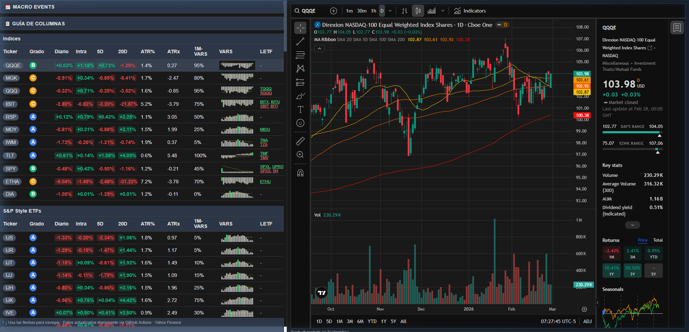

# Market Dashboard

## Vista Previa



Dashboard estático de acciones con actualización diaria de datos (Yahoo Finance), alojado en GitHub Pages.

## Build data locally

```bash
cd market-dashboard
pip install -r requirements.txt
python scripts/build_data.py --out-dir data
```

This generates: `data/snapshot.json`, `data/events.json`, `data/meta.json`, and `data/charts/*.png`.

To preview locally: open `index.html` in a browser, or serve the project root with a static server (e.g. `python -m http.server 8000`) and visit `http://localhost:8000`.

## Despliegue en GitHub Pages

1. Crea un nuevo repositorio en GitHub y sube el contenido de este directorio (o súbelo como la raíz del repo).
2. **Antes del primer despliegue**, necesitas los datos iniciales. Tienes dos opciones:
   - **Recomendado:** En el repositorio, ve a **Actions** → “Refresh dashboard data” → **Run workflow**. Cuando termine, se guardarán los datos en la carpeta `data/` del repo.
   - O ejecútalo localmente: `python scripts/build_data.py --out-dir data`, luego haz `git add data/`, commit y push.
3. En el repositorio, ve a **Settings → Pages**:
   - Configura la Fuente (Source) como **GitHub Actions** (o “Deploy from a branch”).
   - Si usas una rama (branch): elige la rama `master` y la carpeta `/ (root)`.
4. El proceso (workflow) se ejecuta diariamente a las 16:30 US Eastern para actualizar los datos; también puedes ejecutarlo manualmente desde **Actions**.

URL del sitio: `https://<tu-usuario>.github.io/Market_Dashboard/`

## Estructura del proyecto

```
Market_Dashboard/
├── .github/workflows/refresh_data.yml   # Actualización diaria de datos
├── scripts/build_data.py                # Descarga datos, genera JSON + gráficos
├── data/                                # Generado (hacer commit para Pages)
│   ├── snapshot.json
│   ├── events.json
│   ├── meta.json
│   └── charts/*.png
├── index.html                            # Frontend estático
├── requirements.txt
└── README.md
```

Datos: Yahoo Finance (yfinance), calendario económico (investpy). Gráficos: Integración de TradingView.
